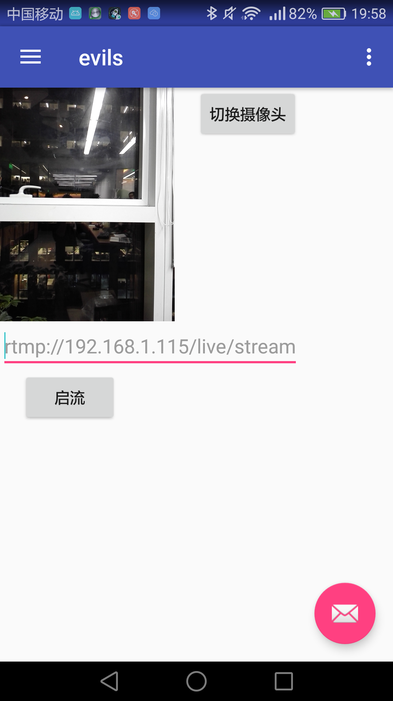

# EvilsLive 
[](https://raw.githubusercontent.com/TinkKeep/evils/master/LICENSE)&nbsp;
[](https://travis-ci.org/ThinkKeep/EvilsLive)

## 项目介绍
EvilsLive 是一个视频直播件开发工具包(SDK), 目前只支持 Android， 以后还会支持 Web/IOS 等平台。 主要负责视频直播的采集、推流、预览、播放、美图支持。

**欢迎大家 Star， 你们的关注才是我们持续的动力!**

**注意：**

>**目前此项目还在持续更新中....**

## 功能特点
* [x] 视频编码：H.264
* [x] 推流协议：RTMP
* [x] 预览与推流分辨率可分别自由设置
* [x] 支持前、后置摄像头动态切换
* [ ] 支持软编、硬编及软编兼容模式
* [ ] 网络自适应，可根据实际网络情况动态调整目标码率，保证流畅性
* [ ] 音频编码：AAC
* [ ] 支持动态横竖屏推流
* [ ] 音视频目标码率：可设

## 项目结构
+ android/app：这里是测试的 sameple
+ android/videolib: 直播相关核心功能实现
+ doc： 文档说明

## Snapshot


## Usage

**要求:**

Android Studio >= 2.2.3

Android API >= 19

**Step 1:**

在进行推流之前，你需要有流媒体服务（视频上传默认rtmp协议），本地搭建或搭建在公有云上，随你意。

例如：rtmp://127.0.0.1/live/hjd_phone

具体可参照 [ossrs/srs](https://github.com/ossrs/srs) 搭建rtmp server

**Step 2:**

具体如何使用可以参照 [app](https://github.com/ThinkKeep/EvilsLive/tree/master/android/app) 中的代码
```java
builder = EvilsLiveStreamerConfig.Builder.newBuilder();
//设置分辨率
builder.setVideoResolution(Defines.EvideoResolution.E720P);
//设置摄像头方向
builder.setCameraFacing(Defines.EcameraFacing.CAMERA_FACING_BACK);
//设置视频预览帧率
builder.setPreviewFrameRate(25);
//设置推流url
builder.setStreamUrl(url);
EvilsLiveStreamerConfig config = builder.build();
//设置预览视图
streamer.setDisplayPreview(mPreviewView);
streamer.setStreamConfig(config);
//停止预览
streamer.stopPreview();
//开启预览
streamer.startPreview();
//开启推流
streamer.startStream();
//停止推流
streamer.stopStream();
```

**测试环境：**

Android 版本： 6.0

硬件： HuaWei H60-L02

## TODO LIST
- [x] 推流(视频)功能 
- [ ] 推流(音频)功能
- [ ] 推流流程优化， 支持硬编、多种流媒体协议等
- [ ] 拉流功能
- [ ] 添加测试用例
- [ ] 机型适配

## 遗留问题
- [ ] 视频采集数据native层处理
- [ ] 支持多种体系结构
- [ ] 支持 Web/IOS 平台

## Copyright and License
Copyright 2016-2017 ThinkKeep


Code released under the MIT License.
